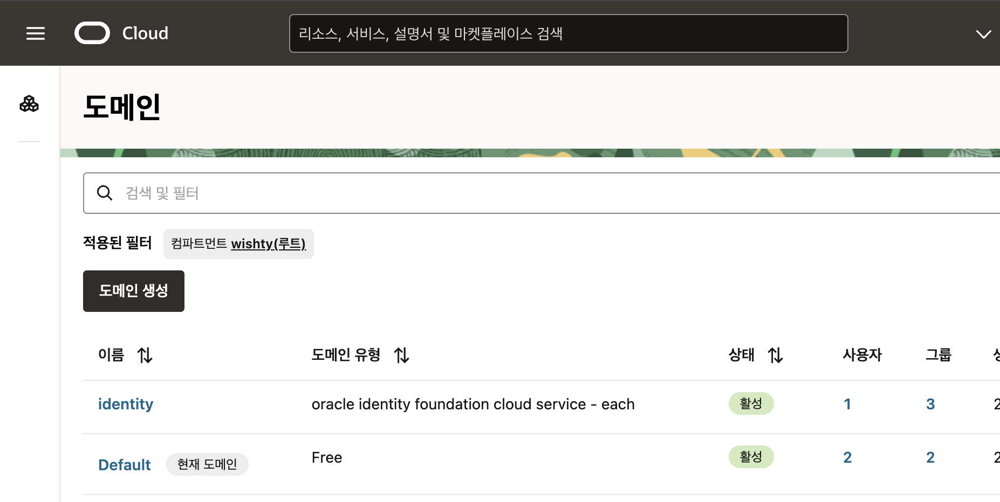
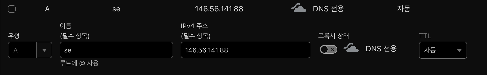
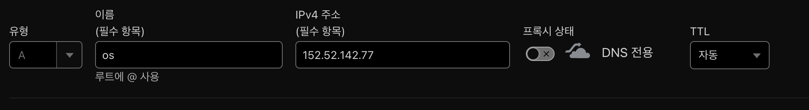

# OCI Infrastructure with Pulumi

Oracle Cloud Infrastructure (OCI)에서 Kubernetes 클러스터를 자동으로 프로비저닝하는 Pulumi 기반 인프라스트럭처 프로젝트입니다.

## 🎯 이 프로젝트가 제공하는 것

- **멀티 리전 OKE 클러스터**: 서울(se)과 오사카(os) 리전에 Kubernetes 클러스터 자동 생성
- **네트워킹**: VCN, 서브넷, 게이트웨이, 보안 그룹 자동 구성
- **IAM 관리**: 필요한 정책 및 그룹 자동 생성
- **클러스터 피어링**: 리전 간 네트워크 연결 설정
- **로드 밸런서**: 서비스 노출을 위한 로드 밸런서 서브넷 구성

## 🚫 이 프로젝트가 제공하지 않는 것

- OCI 계정 생성 및 초기 설정
- 도메인 관리 (Cloudflare DNS 설정은 별도 필요)
- 애플리케이션 배포 (Kubernetes 클러스터만 제공)
- SSL 인증서 관리
- 모니터링 및 로깅 솔루션

## 📋 사전 요구사항

### 1. OCI 계정 및 기본 설정

1. **OCI 계정 생성**
   - [Oracle Cloud 가입](https://cloud.oracle.com)
   - Always Free Tier 또는 Pay-as-you-go 계정 생성

2. **OCI CLI 설치**
   ```bash
   # macOS
   brew install oci-cli

   # Linux
   bash -c "$(curl -L https://raw.githubusercontent.com/oracle/oci-cli/master/scripts/install/install.sh)"

   # Windows
   # PowerShell에서 실행
   powershell -NoProfile -ExecutionPolicy Bypass -Command "iex ((New-Object System.Net.WebClient).DownloadString('https://raw.githubusercontent.com/oracle/oci-cli/master/scripts/install/install.ps1'))"
   ```

3. **OCI CLI 설정**
   ```bash
   oci setup config
   ```
   - User OCID, Tenancy OCID, Region, Private Key Path 입력
   - API Key를 OCI 콘솔에서 등록

### 2. 개발 환경 설정

1. **Python 3.8+ 설치**
2. **Pulumi 설치**
   ```bash
   # macOS
   brew install pulumi

   # Linux/Windows
   curl -fsSL https://get.pulumi.com | sh
   ```

3. **Pulumi 계정 설정**
   ```bash
   pulumi login
   ```

## 🛠️ 설정 가이드

### 1. 프로젝트 설정

```bash
# 프로젝트 클론
git clone https://github.com/flexyzwork/pulumi-python-oke-infrastructure.git
cd pulumi-python-oke-infrastructure

# 개발 환경 설정
make install
```

### 2. OCI 관리자 그룹 확인

OCI 콘솔에서 다음 단계를 수행:

1. [**Identity & Security → 도메인**](https://cloud.oracle.com/identity/domains) 이동
2. 현재 도메인의 그룹 링크 클릭
3. 그룹 탭에서 Administrators 선택
4. Administrators의 OCID 복사 (나중에 config.json에서 사용)

### 3. 사용자를 그룹에 추가

1. [**Identity & Security → 도메인**](https://cloud.oracle.com/identity/domains) 이동
2. 현재 도메인의 사용자 링크 클릭
3. 본인 사용자 검색 후 선택 - Administrators 그룹에 추가

### 4. 관리자 정책 생성

1. [**Identity & Security → Policies**](https://cloud.oracle.com/identity/domains/policies) 이동
2. **Create Policy** 클릭
3. 정책 정보 입력:
   - Name: `Tenant Admin Policy`
   - Description: `Admin policy for OCI infrastructure`
   - Compartment: Root compartment 선택
4. Policy Builder에서 다음 정책 추가:
   ```
   ALLOW GROUP Administrators to manage all-resources IN TENANCY
   ```

### 5. 가용성 도메인 및 이미지 OCID 확인

각 리전에서 다음 정보를 확인:

```bash
# 서울 리전 설정
export OCI_CLI_REGION=ap-seoul-1

# 가용성 도메인 조회
oci iam availability-domain list --compartment-id <your-tenancy-ocid>

# Oracle Linux 이미지 조회 (ARM 기반)
oci compute image list --compartment-id <your-tenancy-ocid> --operating-system "Oracle Linux" --shape "VM.Standard.A1.Flex"

# 오사카 리전도 동일하게 수행
export OCI_CLI_REGION=ap-osaka-1
# 위 명령어들 재실행
```

### 6. 설정 파일 생성

Pulumi config에 SSH 공개키를 설정:

```bash
pulumi config set --secret ssh_public_key "your-ssh-public-key"
# 예시
pulumi config set --secret ssh_public_key "ssh-ed25519 AAAAC3NzaC1lZ......"
```
pulumi.prod.yaml 파일에 암호화되어 저장됨

```bash
# 예제 파일 복사
cp config.json.example config.json
```

`config.json` 파일을 편집하여 실제 값으로 업데이트:

```json
{
  "peer_map": {
    "se": ["os"]
  },
  "home_region": "os",
  "node": {
    "kubernetes_version": "v1.32.1",
    "node_pool_name": "pool1",
    "node_pool_size": 2,
    "node_shape": "VM.Standard.A1.Flex",
    "node_memory_gbs": 12,
    "node_ocpus": 2
  },
  "regions": {
    "se": {
      "availability_domain": "YOUR_SEOUL_AD",
      "service_cidr": "all-icn-services-in-oracle-services-network",
      "service_id": "YOUR_SEOUL_SERVICE_ID",
      "image_id": "YOUR_SEOUL_IMAGE_ID",
      "vcn_cidr_block": "10.10.0.0/16",
      "node_subnet_cidr_block": "10.10.10.0/24",
      "k8s_api_subnet_cidr_block": "10.10.20.0/24",
      "service_lb_subnet_cidr_block": "10.10.30.0/24",
      "admin_group_id": "YOUR_ADMIN_GROUP_OCID"
    },
    "os": {
      "availability_domain": "YOUR_OSAKA_AD",
      "service_cidr": "all-kix-services-in-oracle-services-network",
      "service_id": "YOUR_OSAKA_SERVICE_ID",
      "image_id": "YOUR_OSAKA_IMAGE_ID",
      "vcn_cidr_block": "10.30.0.0/16",
      "node_subnet_cidr_block": "10.30.10.0/24",
      "k8s_api_subnet_cidr_block": "10.30.20.0/24",
      "service_lb_subnet_cidr_block": "10.30.30.0/24",
      "admin_group_id": "YOUR_ADMIN_GROUP_OCID"
    }
  }
}
```

## 🚀 배포

### 1. 스택 초기화 및 배포

```bash
# 새 스택 생성
pulumi stack init prod

# 스택 확인
pulumi stack ls -a
NAME                            LAST UPDATE  RESOURCE COUNT  URL
prod*                           n/a          n/a             https://app.pulumi.com/flexyzwork/oke-infra/prod

# 스택 선택 (참고)
pulumi stack select prod

```

### 2. 설정 확인

```bash
# 설정 미리보기
make preview
```

### 2. 인프라스트럭처 배포

```bash
# 전체 인프라스트럭처 배포
make up
```

배포는 약 10-15분 소요됩니다.

### 3. 배포 상태 확인

```bash
# Pulumi 스택 상태 확인
pulumi stack ls

# 리소스 상태 확인
pulumi stack output
```

## 🔧 사용법

### 클러스터 접근 설정 (Kubeconfig 설정)

OKE 클러스터의 kubeconfig는 `~/.kube/config-<region>` 파일에 저장 되어 있음


```bash
# 각 환경별 kubeconfig 다운로드 (참고)
oci ce cluster create-kubeconfig --cluster-id <cluster-id> --file ~/.kube/config-os
oci ce cluster create-kubeconfig --cluster-id <cluster-id> --file ~/.kube/config-se

# 컨텍스트 전환
export KUBECONFIG=~/.kube/config-se
kubectl get nodes

export KUBECONFIG=~/.kube/config-os
kubectl get nodes
```

### 도메인 설정 (별도 작업)

예시
```
Outputs:
   os-public_ip_address               : "146.56.141.88"
   se-public_ip_address               : "152.52.142.77"
```

Cloudflare DNS에서 도메인 연결:
1. Cloudflare 대시보드 접속
2. DNS Records에서 A 레코드 추가




## 📁 프로젝트 구조

```
.
├── __main__.py              # Pulumi 메인 진입점
├── cluster/                 # OKE 클러스터 관리
├── compartment/            # OCI Compartment 관리
├── config/                 # 설정 관리
├── iam/                    # IAM 정책 및 그룹 관리
├── network/                # VCN, 서브넷, 보안 그룹 관리
├── utils/                  # 유틸리티 함수
├── config.json             # 실제 환경 설정 (생성 필요)
├── config.json.example     # 설정 예제 파일
└── Makefile               # 빌드 및 배포 스크립트
```

## 🛠️ 사용 가능한 명령어

```bash
# 개발 환경 설정
make install

# 설정 미리보기
make preview

# 인프라스트럭처 배포
make up

# 인프라스트럭처 삭제
make destroy

# 로그 확인
tail -f app.log
```

## ⚠️ 주의사항

1. **비용**: VM.Standard.A1.Flex 인스턴스는 Always Free Tier에 포함되지만, 사용량을 모니터링하세요
2. **리전 제한**: 일부 리전에서는 A1 인스턴스를 사용할 수 없을 수 있습니다
3. **리소스 한도**: OCI 계정의 서비스 한도를 확인하세요
4. **네트워크**: CIDR 블록이 겹치지 않도록 주의하세요

## 🐛 문제 해결

### 일반적인 오류

1. **Authentication Error**
   ```bash
   # OCI CLI 설정 재확인
   oci setup config
   ```

2. **Capacity Issue**
   - 다른 가용성 도메인 시도
   - 다른 인스턴스 타입 시도

3. **Network CIDR Conflict**
   - config.json의 CIDR 블록 수정

4. **Policy Errors**
   - IAM 정책 및 그룹 설정 재확인

### 로그 확인

```bash
# 애플리케이션 로그
tail -f app.log

# Pulumi 로그
pulumi logs
```

## 📚 참고 자료

- [OCI Documentation](https://docs.oracle.com/en-us/iaas/)
- [Pulumi OCI Provider](https://www.pulumi.com/registry/packages/oci/)
- [OKE Documentation](https://docs.oracle.com/en-us/iaas/Content/ContEng/home.htm)

## 🤝 기여

이슈나 개선사항이 있으시면 GitHub Issues를 통해 알려주세요.

## 📄 라이선스

MIT License
